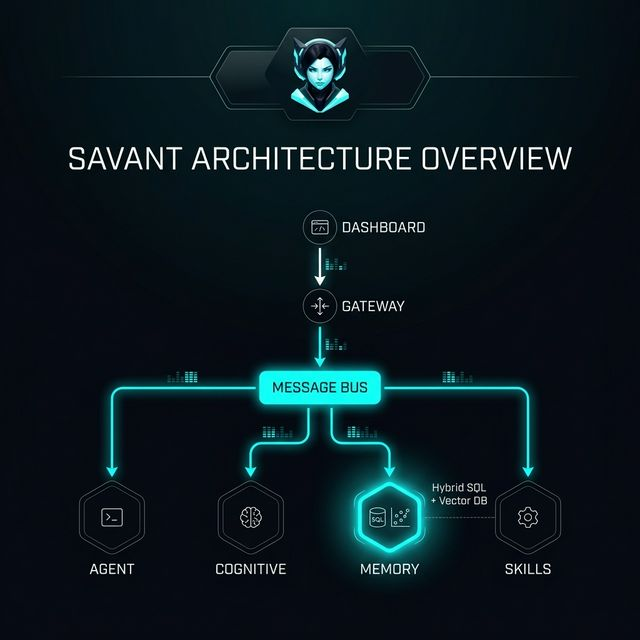
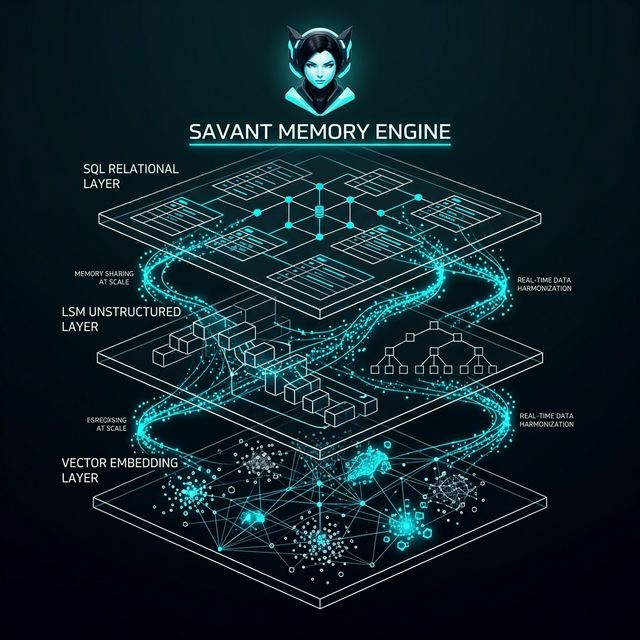
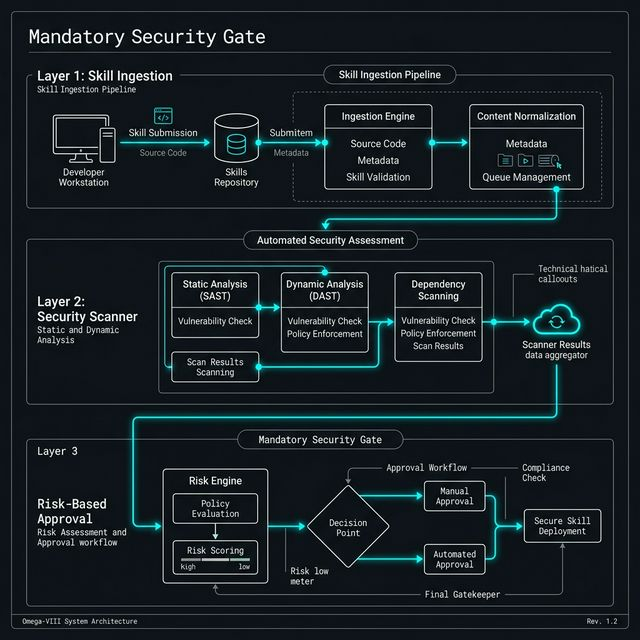
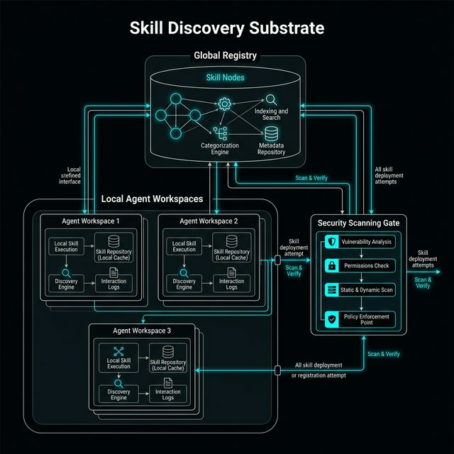

<!-- markdownlint-disable MD033 -->
<div align="center">


# SAVANT v1.5.0

**One Mind. A Thousand Faces.**

A production-grade, Rust-native framework for building, deploying, and coordinating swarms of autonomous AI agents with OMEGA-VIII certification, mandatory security scanning, and real-time substrate observability.

[](https://www.rust-lang.org/)[](https://nextjs.org/)[](https://tauri.app/)[](https://github.com/tokio-rs/axum/)[](https://sqlite.org/)[](https://github.com/fjall-rs/fjall)[](https://ollama.com/)[](LICENSE)

</div>

---

## Overview

Savant is an autonomous agent swarm orchestrator with **mandatory security scanning** for all skills:

- **Swarm Orchestration** — Spawn, coordinate, and manage hundreds of concurrent AI agents from a unified control plane
- **15 AI Providers** — OpenRouter, OpenAI, Anthropic, Google, Mistral, Groq, Deepseek, Cohere, Together, Azure, xAI, Fireworks, Novita, Ollama, LmStudio
- **OpenClaw Skill Compatibility** — Install skills from ClawHub with automatic OpenClaw `SKILL.md` format parsing
- **Mandatory Security Scanning** — Every skill is scanned before execution; user sovereignty with click-based approval (0-3 clicks based on risk)
- **Real-Time Dashboard** — A Next.js observability dashboard with live WebSocket streaming, message history, cognitive insights, and soul manifestation
- **Multi-Channel Gateway** — Axum-based WebSocket gateway with authentication, message routing, and event-driven architecture
- **Persistent Memory** — Hybrid storage combining SQLite (WAL), Fjall LSM-tree, and rkyv-serialized vector embeddings
- **Cognitive Architecture** — Goal decomposition, strategic synthesis, memory consolidation, and proactive heartbeat loops
- **Threat Intelligence** — Global blocklist sync with configurable threat intelligence feed
- **Smart Build System** — Incremental compilation with automatic source change detection
- **Config Auto-Reload** — Live configuration updates via file watcher

---

<div align="center">

## Architecture



</div>

---

<div align="center">

## Distributed Memory Substrate



</div>

Savant utilizes an OMEGA-grade **Hybrid Memory Engine** that unifies three distinct data layers into a single, high-performance substrate for swarm-wide memory sharing at scale:

- **Relational SQL Layer (SQLite WAL)**: Handles structured metadata, agent relationships, and transactional mission logs with ACID compliance.
- **Unstructured LSM Layer (Fjall)**: A high-throughput Log-Structured Merge-tree for rapid ingestion of raw telemetry and internal agent reflections.
- **Spatial Vector Layer (rkyv)**: Ultra-fast, zero-copy serialization of vector embeddings for real-time semantic search and long-term memory consolidation.

**Swarm-Wide Sharing**: Every agent in the swarm shares a unified memory bus, allowing for cross-agent learning, collective intelligence synthesis, and zero-latency context inheritance.

---

## Security Model

<div align="center">




</div>

Savant implements a **mandatory security gate** for all skills. Every skill must pass through the security scanner before execution. The user is always sovereign — no hard blocks, but increasing click friction based on risk:

| Risk Level | Clicks Required | Behavior |
| :--- | :---: | :--- |
| **Clean** | 0 | Auto-proceed, no prompts |
| **Low** | 0 | Proceed with notification |
| **Medium** | 1 | Acknowledge findings |
| **High** | 2 | Double-confirm with full disclosure |
| **Critical** | 3 | Triple-confirm with "I understand the risks" |

### Security Scanner Capabilities

- **Global Blocklist** — Hash-based and name-based blocking, synced with threat intelligence feed
- **Malicious URL Detection** — Shortened URLs, pastebin, executables, direct IP access
- **Credential Theft Detection** — SSH keys, AWS credentials, GPG, keychain, environment variables
- **Fake Prerequisite Detection** — Snyk attack pattern (fake required packages)
- **Data Exfiltration Detection** — Webhooks, base64 encoding of sensitive files
- **Dangerous Command Detection** — sudo, chmod 777, crontab, pipe-to-bash
- **10 Proactive Checks:**
  1. Clipboard hijacking
  2. Persistence injection
  3. Lateral movement
  4. Cryptojacking
  5. Reverse shell
  6. Keylogger
  7. Screen capture
  8. Time-bomb
  9. Typosquatting (Levenshtein distance)
  10. Dependency confusion (async registry verification)

---

## Quick Start

### Prerequisites

- **Rust** 1.75+ (stable)
- **Node.js** 18+ (for the dashboard)
- **AI Provider API Key** (OpenRouter, OpenAI, Anthropic, etc.)

### 1. Smart Launch (Recommended)

The smart launcher handles building, dependency installation, and service startup:

```bash
# Windows
start.bat

# Force rebuild
start.bat --force

# Skip build (use existing binary)
start.bat --skip
```

The launcher polls the `/live` health endpoint until the gateway is ready (max 30s), then starts the dashboard.

### 2. Manual Launch

```bash
# Start the Gateway and Swarm
cargo run --release --bin savant_cli

# In another terminal, start the Dashboard
cd dashboard
npm install  # first time only
npm run dev
```

The gateway starts on `ws://127.0.0.1:3000/ws` and the dashboard at `http://localhost:3000`.

### 3. Configuration

**Secrets** go in `.env` (never committed):

```env
# OpenRouter API Key (or your preferred provider)
OR_MASTER_KEY=sk-or-v1-...

# Dev mode (auto-generates master keys, no API key required)
SAVANT_DEV_MODE=1
```

**Settings** go in `config/savant.toml` (committed):

```toml
[ai]
provider = "openrouter"
model = "openrouter/healer-alpha"
temperature = 0.4
max_tokens = 262144

[server]
port = 3000
host = "0.0.0.0"

[system]
db_path = "./data/savant"          # Sovereign substrate storage
memory_db_path = "./data/memory"   # Agent memory engine (separate instance)
```

Changes to `savant.toml` are applied automatically via file watcher.

---

## Skill Management

<div align="center">




</div>

### Installing Skills from ClawHub

```rust
// Skills are automatically scanned before installation
let manager = SkillManager::new(skills_dir);
let result = manager.install_from_clawhub("username/skill-name", None).await?;

match result {
    InstallResult { success: true, .. } => println!("Skill installed"),
    InstallResult { success: false, gate_result: Some(gate), .. } => {
        // Show approval prompt to user
        let prompt = gate.approval_prompt();
        println!("{} - {} clicks required", prompt.warning_message, prompt.clicks_required);
    }
}
```

### Skill Discovery

Skills are discovered from two locations:
- **Swarm-wide:** `<workspace>/skills/`
- **Agent-specific:** `<workspace>/workspaces/workspace-{name}/skills/`

Every discovered skill is mandatory-scanned before loading.

### OpenClaw Compatibility

Skills use the OpenClaw format with `SKILL.md` files:

```markdown
---
name: my-skill
description: A useful skill for doing things
version: 1.0.0
author: username
metadata:
  capabilities: ["file-read", "web-search"]
---

# My Skill

Instructions and implementation details...
```

---

## Crate Map

| Crate | Purpose |
| :--- | :--- |
| `savant_core` | Shared types, config, error handling, traits, Fjall DB |
| `savant_gateway` | Axum WebSocket server, authentication, skill control, config watcher |
| `savant_agent` | Agent lifecycle, swarm coordination, 15 LLM providers |
| `savant_cognitive` | Strategic synthesis, goal decomposition, proactive loops |
| `savant_memory` | Hybrid storage (Fjall LSM + vectors + consolidation) |
| `savant_skills` | OpenClaw skills, security scanner, ClawHub, Docker/Nix |
| `savant_ipc` | Zero-copy inter-process communication |
| `savant_echo` | ECHO protocol (speculative ReAct + circuit breaker) |
| `savant_canvas` | A2UI rendering and LCS-based diff |
| `savant_channels` | Discord, Telegram, WhatsApp, Matrix integrations |
| `savant_mcp` | MCP server with auth + circuit breaker |
| `savant_cli` | CLI entry point with --config and --keygen |
| `savant_security` | CCT token verification, PQC signatures |
| `savant_panopticon` | Monitoring and telemetry |
| `savant_desktop` | Tauri-based desktop companion |
| `savant_test_suite` | Global integration and heuristic testing |

---

## Project Structure

```text
Savant/
├── Cargo.toml              # Workspace root (wasmtime 36)
├── start.bat               # Smart launcher (incremental builds)
├── .env                    # Secrets (API keys, never committed)
├── config/
│   └── savant.toml         # Settings (auto-reloads on change)
├── CHANGELOG.md            # Release changelog
├── dev/                    # Development process & tracking
│   ├── development-process.md
│   ├── PENDING.md
│   ├── perfection.md
│   ├── LEARNINGS.md
│   ├── ERRORS.md
│   ├── roadmap/
│   │   └── roadmap-fix.md
│   ├── archive/
│   └── reviews/
├── crates/
│   ├── core/               # Shared types, config, DB, errors
│   ├── gateway/            # Axum WebSocket server + auth + routing
│   ├── agent/              # Agent lifecycle, swarm, 15 LLM providers
│   ├── cognitive/          # Synthesis, decomposition, proactive loops
│   ├── memory/             # Hybrid storage engine + consolidation
│   ├── skills/             # OpenClaw skills + security + ClawHub
│   ├── ipc/                # Zero-copy IPC substrate
│   ├── echo/               # ECHO protocol + circuit breaker
│   ├── mcp/                # MCP server with auth
│   ├── canvas/             # A2UI rendering + LCS diff
│   ├── channels/           # Discord, Telegram, WhatsApp, Matrix
│   ├── cli/                # CLI entry point
│   ├── security/           # CCT verification, PQC signatures
│   └── panopticon/         # Telemetry and monitoring
├── dashboard/              # Next.js 16 observability dashboard
├── workspaces/
│   ├── substrate/          # Savant's own files
│   └── agents/             # Agent workspaces (swarm members)
├── data/
│   ├── savant/             # Sovereign substrate storage (Fjall)
│   └── memory/             # Agent memory engine (separate Fjall)
├── skills/                 # Installed skills
└── docs/
    ├── architecture/       # System design documentation
    ├── api/                # WebSocket protocol reference
    ├── security/           # Security model documentation
    ├── reviews/            # Current audit reports
    ├── roadmap/            # Fix tracking
    ├── llm-parameters.md   # LLM parameter guide
    └── archive/            # Archived audit/roadmap reports
```

---

## Documentation

- [Autonomous Workflow](docs/AUTONOMOUS-WORKFLOW.md) — The overnight automation protocol
- [Gap Analysis](docs/GAP-ANALYSIS.md) — 10 high-impact features users will love
- [Architecture Overview](docs/architecture/) — System design and data flow
- [API Reference](docs/api/) — Control frame schemas and WebSocket protocol
- [Security Model](docs/security/) — Authentication, sandboxing, and threat detection
- [Changelog](CHANGELOG.md) — Release history and changes
- [Audit Report](AUDIT.md) — Production readiness audit

---

## Building

```bash
# Build all crates
cargo build

# Run all tests
cargo test --workspace

# Check for warnings (should be zero)
cargo check

# Build release
cargo build --release
```

---

<div align="center">

_Savant is an Atlas-class autonomous project._

**Savant** &bull; 2026

</div>
