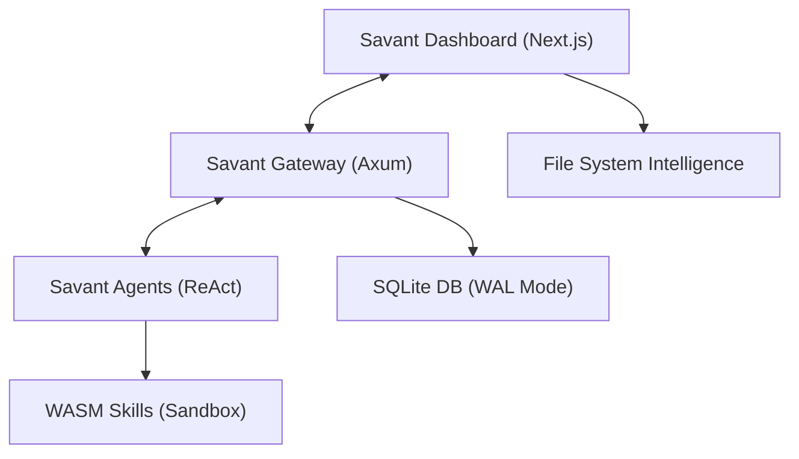

# Savant - Autonomous Agent Swarm System

A Rust-based autonomous agent framework with swarm intelligence, ReAct agents, and real-time dashboard orchestration.

## 🚀 Quick Start

### Option 1: One-Click Startup (Recommended)

**Windows:**

```bash
start.bat
```

**Linux/macOS:**

```bash
chmod +x start.sh
./start.sh
```

**Node.js (Cross-platform):**

```bash
npm install
npm start
```

### Option 2: Make Commands

```bash
make help    # Show all commands
make start   # Start complete system
make stop    # Stop all services
```

### Option 3: Manual Startup

```bash
# Terminal 1: Start Gateway and Swarm
cargo run --release --bin savant_cli

# Terminal 2: Start Dashboard
cd dashboard
npm install
npm run dev
```

## 📱 Access Points

- **Savant Dashboard**: <http://localhost:3000>
- **Savant Gateway**: <http://localhost:8080>
- **WebSocket**: `ws://localhost:8080/ws`

## 🏗️ System Architecture



## 🧩 Components

### Core Framework

- **Savant Gateway**: WebSocket server with authentication and session management
- **Savant Agents**: ReAct-based autonomous agents with LLM integration
- **Savant Skills**: WASM sandboxed capability execution
- **Savant Swarm**: Hierarchical task delegation and coordination

### LLM Providers

- Anthropic Claude
- OpenAI GPT
- OpenRouter
- Ollama (Local)
- LM Studio (Local)
- Groq
- Perplexity

### Dashboard Features

- Real-time Savant swarm telemetry
- Savant agent control plane
- Manual intervention
- Directive broadcasting
- Live performance metrics

## 📁 Project Structure

```text
savant/
├── crates/                 # Savant Rust workspace
│   ├── core/              # Savant core types and config
│   ├── gateway/           # Savant WebSocket server
│   ├── agent/             # Savant ReAct agents
│   ├── skills/            # Savant WASM sandbox
│   ├── mcp/               # Savant MCP protocol
│   ├── channels/          # Savant communication
│   ├── canvas/            # Savant visual workspace
│   └── cli/               # Savant command line interface
├── dashboard/              # Savant Next.js UI
├── workspaces/            # Savant agent configurations
├── logs/                  # Savant runtime logs
├── start.sh              # Savant Linux/macOS launcher
├── start.bat             # Savant Windows launcher
├── start.js              # Savant Node.js launcher
├── stop.js               # Savant stop script
├── Makefile              # Savant build commands
└── package.json          # Savant NPM scripts
```

## 🔧 Development

### Prerequisites

- Rust (latest stable)
- Node.js 18+
- SQLite

### Development Mode

```bash
npm run dev    # Start with file watching
make dev       # Alternative with Make
```

### Testing

```bash
npm test       # Run all tests
make test      # Alternative with Make
```

### Building

```bash
npm run build  # Build all components
make build     # Alternative with Make
```

## 📊 Monitoring

### Logs

- Savant Gateway: `logs/gateway.log`
- Savant Dashboard: `logs/dashboard.log`
- Live view: `make logs` or `npm run logs`

### Performance

- Real-time metrics in dashboard
- WebSocket telemetry
- Agent heartbeat monitoring

## 🛠️ Configuration

Configuration is handled through:

- `config.toml` (Savant main config)
- Environment variables
- Savant Agent `soul.md` files
- CLI arguments

## 🚦 Status

### Completed Phases ✅

- Phase 1: Workspace scaffolding
- Phase 2: Filesystem intelligence
- Phase 3: Gateway control plane
- Phase 4: ReAct agents and LLM providers
- Phase 5: Skill sandbox and swarm autonomy
- Phase 6: Next.js dashboard and persistent memory

### In Progress 🏗️

- Phase 7: Alignment & Convergence (Elite features)

## 🤝 Contributing

1. Fork the repository
2. Create a feature branch
3. Make your changes
4. Run tests: `npm test`
5. Submit a pull request

## 📄 License

MIT License - see LICENSE file for details.

## 🔗 Links

- [Documentation](docs/)
- [Issues](https://github.com/savant/savant/issues)
- [Discussions](https://github.com/savant/savant/discussions)
