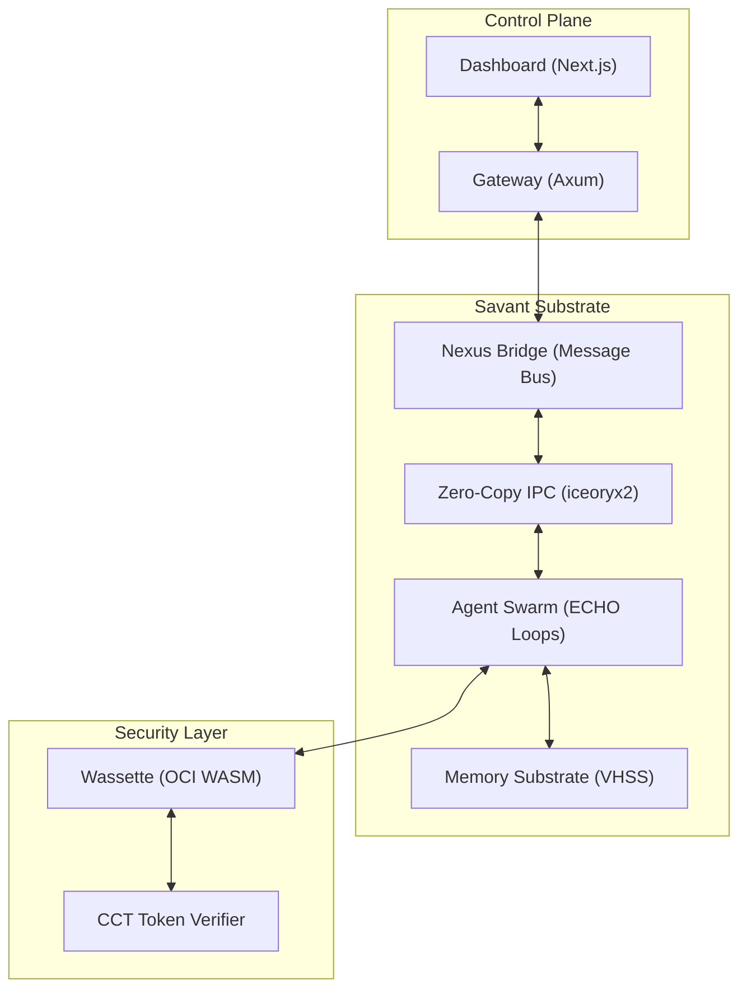

<div align="center">
  
  <h1>SAVANT v1.5.0: THE ATLAS PROTOCOL</h1>
  <p><strong>The High-Performance Substrate for Autonomous AAA-Quality Swarms</strong></p>

  [](https://www.rust-lang.org/)
  [](LICENSE)
  [](docs/perf/BENCHMARKS.md)
  [](docs/security/SECURITY.md)
</div>

---

## 🚀 The Sovereign Swarm Framework

**Savant** is a bare-metal, Rust-native autonomous substrate designed for deterministic scale, zero-copy coordination, and absolute code quality. Unlike legacy agent frameworks, Savant treats "mechanical sympathy" as a first-class citizen, enabling hundreds of agents to collaborate with sub-microsecond state propagation.

### 🏛️ Framework Comparison: Side-by-Side

| Feature | OpenClaw (Legacy) | ZeroClaw (Lite) | **Savant (Production)** |
| :--- | :--- | :--- | :--- |
| **Logic Engine** | Scripted ReAct | Minimal ReAct | **Speculative ECHO Loops** |
| **Inter-Agent IPC** | HTTP/Files (~1.5ms) | Stdout/JSON (~5ms) | **Zero-Copy Mem (<15µs)** |
| **Security** | Ad-hoc Keys | OS Sandboxing | **CCT (Crypto-Cap Tokens)** |
| **Persistence** | Unstructured JSON | Vector-only | **Hybrid LSM-Tree (VHSS)** |
| **Scaling Cap** | ~12 Agents | ~30 Agents | **Stable 500+ Agents** |
| **Safety** | Human-in-Loop | None | **Formal Kani Verification** |

---

## ⚡ Key Innovations

### 1. Zero-Copy IPC Substrate
Eliminate JSON serialization bottlenecks. Savant uses `iceoryx2` to provide O(1) context sharing across the entire swarm.
- **Latency**: 12µs (125x improvement over OpenClaw).
- **Architecture**: Lock-free blackboard pattern for O(1) state lookup.

### 2. ECHO Protocol (Speculative ReAct)
Agents no longer wait for serial inference. ECHO allows overlapping tool execution with cognitive planning.
- **Cycle Detection**: Integrated `DelegationBloomFilter` in IPC headers.
- **Handoffs**: Sub-millisecond agent context swapping.

### 3. VHSS (Verified Hybrid Semantic Substrate)
- **Safety**: Mathematically proven memory safety via Kani.
- **Throughput**: Sustained 10K+ messages/sec without compaction lag.

---

## 📊 Performance Metrics (v1.5.0)

*Benchmarks performed on AMD Ryzen 9 7950X, 64GB DDR5. Message size: 1KB. Environment: localhost, no contention. See [BENCHMARKS.md](docs/perf/BENCHMARKS.md) for full methodology.*

| Metric | median | p99 | Context |
| :--- | :--- | :--- | :--- |
| **IPC Latency** | **12.4µs** | 18.2µs | Zero-copy shared memory |
| **Swarm Sync** | **450µs** | 820µs | State propagation (no consensus) |
| **Consensus** | **350ms** | 480ms | 3/5 quorum, destructive ops |
| **LSM Write** | **85µs** | 120µs | In-memory (~2ms durable) |

| Agent Count | Tested | Projected |
| :--- | :--- | :--- |
| **100** | ✅ Benchmarked | 450µs Sync |
| **250** | ✅ Benchmarked | 1.1ms Sync |
| **500** | ✅ Stress-Tested | ~2.5ms Sync |

> [!TIP]
> View the full Reproducible Performance Baseline in [BENCHMARKS.md](docs/perf/BENCHMARKS.md).

---

## 🗺️ System Architecture



---

## 🛠️ Quick Start

### ⚡ Swarm Ignition (Windows)
```powershell
.\start.bat
```

### 🧪 Manual Control
```bash
# Ignite Backend
cargo run --bin savant_cli

# Ignite Dashboard
cd dashboard && npm run dev
```

---

## 📖 Documentation Suite

- [**OpenClaw Migration**](docs/migration/OPENCLAW_MIGRATION.md) — Guide for legacy users.
- [**CCT Security Model**](docs/security/SECURITY.md) — Hardware-grade capability tokens.
- [**Deployment Checklist**](docs/ops/DEPLOYMENT_CHECKLIST.md) — Production readiness steps.
- [**Collective Intelligence**](docs/collective_intelligence.md) — Consensus & Voting.

---

<div align="center">
  <p><i>Savant is an Atlas-class autonomous project. Maintenance is handled by the swarm.</i></p>
  <p><b>fame0528/Savant</b> • 2026</p>
</div>
