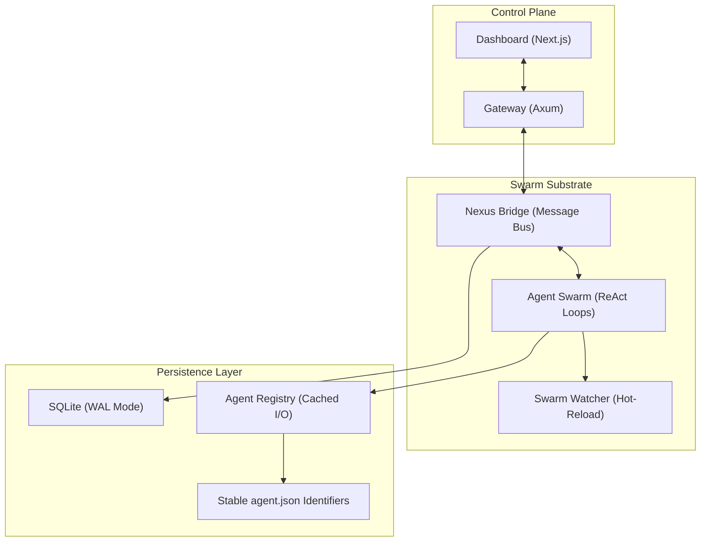

<div align="center">
  
  <h1>SAVANT v1.5.0: ATLAS EDITION</h1>
  <p><strong>Autonomous AAA-Quality Expert Development Swarm</strong></p>

  [](https://www.rust-lang.org/)
  [](https://nextjs.org/)
  [](https://www.typescriptlang.org/)
  [](https://tailwindcss.com/)
</div>

---

## 🌌 Overview

**Savant** is a high-performance, autonomous agent swarm engineered for deterministic scale and absolute code quality. Built on a hardened Rust substrate and real-time Next.js orchestration, Savant transcends traditional agent frameworks by implementing the **Perfection Loop**—a continuous, iterative refinement engine that drives features to a state of absolute perfection.

### ⚡ Core Capabilities

- **Autonomous Swarm Logic**: Independent agents with stable identities and persistent memory.
- **Hot-Reload Sync**: Real-time agent reloading and swarm synchronization without downtime.
- **Nexus Bridge**: High-concurrency message bus with SQLite WAL persistence.
- **Visual Telemetry**: AAA-quality dashboard with multi-agent pulse monitoring.
- **Perfection-as-a-Service**: Integrated refinement protocols baked into the agent SOUL.

---

## 🏛️ System Architecture

Savant utilizes a distributed memory model and a centralized control plane to maintain a "Single Source of Truth" across over 100 concurrent agents.



### 📦 Hardened Crates

- `savant_core`: Zero-copy types, custom error handling, and registry caching.
- `savant_agent`: ReAct loops, heartbeat pulses, and live-reloading watchers.
- `savant_gateway`: WebSocket handlers, session management, and SVG avatar generation.
- `savant_cli`: Swarm ignition, provisioning, and unified startup.

---

## 🔄 The Perfection Loop

Everything built within the Savant ecosystem undergoes the **Perfection Loop**. This protocol ensures that every module is audited, optimized, and refined until further improvements are non-effective.

1. Discovery: Identify weak points, technical debt, or performance bottlenecks.
2. Audit: Comprehensive alignment check against Savant AAA standards.
3. Refinement: Iterative code generation to resolve all findings.
4. Verification: 0-error, 0-warning TypeScript and Rust compilation.
5. Convergence: Finalization of the feature at peak mechanical sympathy.

---

## 🗺️ Savant Prime Roadmap

The horizon for Savant represents a transition to **Savant Prime**—a bare-metal, SIMD-accelerated agent engine.

### Phase 1: High-Density Substrate (Active)

- [x] Stable Agent Identifiers (UUID)
- [x] Hot-Reloading Watcher Implementation
- [x] Registry I/O Path Caching
- [ ] **LSM-Tree Persistence**: Moving history to `Fjall 3.0` for sub-millisecond writes.

### Phase 2: Cognitive Acceleration

- [ ] **Dynamic Speculative Planning**: Overlapping tool execution with inference.
- [ ] **SIMD Vector Search**: `AVX-512` accelerated semantic retrieval.
- [ ] **Wasm Sandboxing**: Transitioning from OS-level execution to Wassette SFI.

### Phase 3: Sovereign Swarm

- [ ] **Distributed IPC**: Zero-copy state sharing via `iceoryx2`.
- [ ] **Generative A2UI**: Real-time binary UI streaming to the WebGPU frontend.

---

## 🛠️ Quick Start

### ⚡ Swarm Ignition

The fastest way to ignite the swarm on Windows:

```powershell
.\start.bat
```

### 🧪 Manual Control

If you prefer granular control over the build process:

```bash
# Terminal 1: Rust Backend
cargo run --bin savant_cli

# Terminal 2: Dashboard Frontend
cd dashboard && npm run dev
```

---

## 📊 Deployment Metrics (v1.5.0)

| Module | Status | Concurrency | Reliability |
| :--- | :--- | :--- | :--- |
| **Core** | Stable | N/A | High (0-Fault) |
| **Swarm** | Active | 100+ Agents | Hot-Reloading |
| **Gateway** | Fast | 2000+ Conn | WAL-backed |
| **Dashboard** | Premium | 60 FPS | Real-time |

---

<div align="center">
  <p><i>Savant is an Atlas-class autonomous project. Maintenance is handled by the swarm.</i></p>
  <p><b>fame0528/Savant</b> • 2026</p>
</div>
