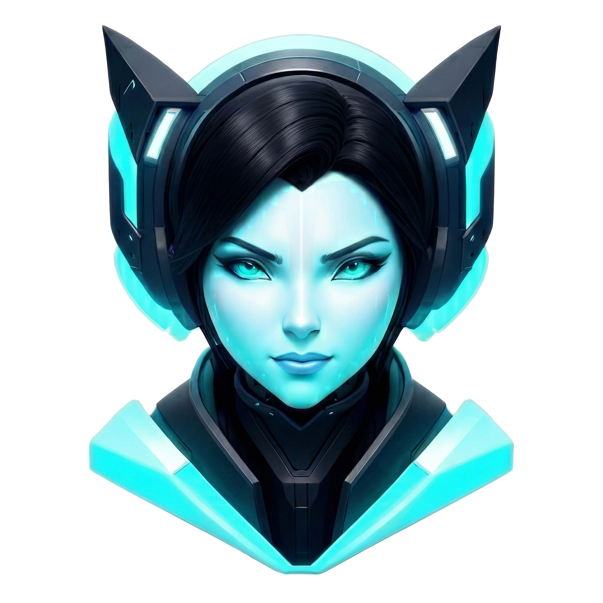
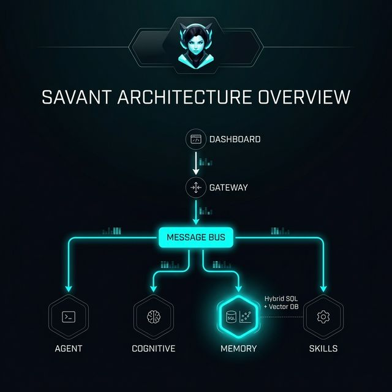
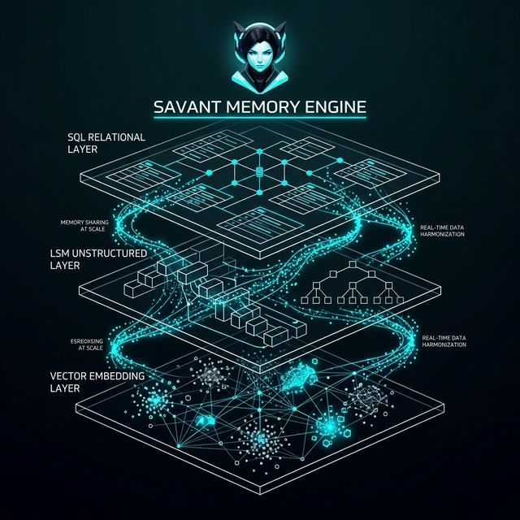
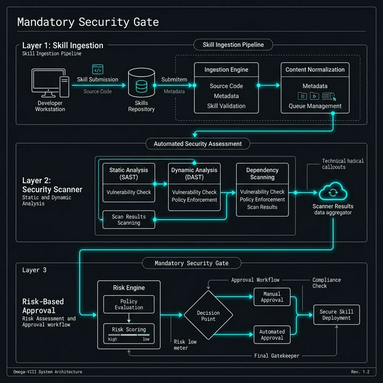
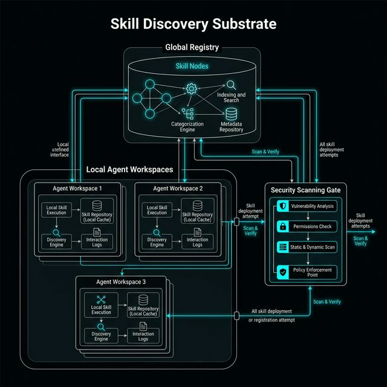

# SAVANT v0.4.0

<!-- markdownlint-disable MD033 -->
<div align="center">



**One Mind. A Thousand Faces.**

A production-grade, Rust-native framework for building, deploying, and coordinating swarms of autonomous AI agents with mandatory security scanning and real-time substrate observability.

**Free, Unlimited AI — MIMO v2.5 Pro:** Savant ships with [OpenGateway](https://gitlawb.com/opengateway) as the default provider — an open inference gateway sponsored by Xiaomi MiMo. Zero setup, no API key required. MIMO v2.5 Pro is Xiaomi's flagship agentic model: **Agentic Index 67.4 (top 3%)**, **Intelligence Index 53.8 (top 4%)**, **Coding Index 45.5 (top 8%)**, 1M context window, 131K max output, 1000+ tool calls per task. Performance approaching Opus 4.6.

**Zero Warning Build:** `cargo clippy --workspace --all-targets -- -D warnings` produces zero warnings. Zero `unwrap()`/`expect()` in non-test code. Enterprise-grade error handling throughout.

**Security Hardening (2026-05-28):** Authenticated image loading via blob URLs. REST API auth middleware with rate-limited logging. REST API authentication middleware with constant-time comparison. Immutable security fields (5 fields blocked at runtime). Canvas WebSocket auth. SoulUpdate/BulkManifest/NLCommand size limits. Environment variable filtering for spawned processes. Mandatory SecurityScanner (no optional bypass).

**Consciousness Layer (2026-05-25):** Continuously thinking daemon that observes the hivemind via zero-copy shared memory. Entropy-based cadence (0ms–300s). Reconstructive narrative synthesis (Markov chain). Wonder engine for autonomous exploration. Anti-echo-chamber for diversity enforcement. Consciousness budget with quiet hours.

**Resource Governor (2026-05-25):** CPU/memory-aware agent spawning with adaptive concurrency. Four pressure levels (Low/Medium/High/Critical). Deferred agent queue with max retry. Lock-free pressure reads via atomics.

**Provider Chain Resilience (2026-05-25):** True streaming (chunks yielded directly, no collect-then-replay). Cross-provider fallback actually wired. Circuit breaker race condition fixed. 120s configurable call timeout. RateLimiter integration.

**LLM-Driven Skill Synthesis (2026-05-25):** SovereignSynthesizer now uses LLM for code generation with template fallback. Self-healing error feedback loop (max 3 attempts). Pinned dependency versions. Skill chaining with `depends_on` and `chain_with` fields.

**Desktop App:** Tauri 2.x with auto-updater, splash screen, dependency checker. Users always have the latest version.

**Gemma 4 Model System (2026-05-15):** Local fallback model for vision and embeddings. Even when MIMO v2.5 Pro is the primary chat model, Gemma 4 automatically handles vision and embeddings via Ollama. 4 variants available (E2B 3GB, E4B 8GB, 26B 18GB, 31B 22GB). On-demand loading — vision model loads per-request and unloads immediately after to minimize memory. Ollama auto-start with model auto-pull. Full setup wizard with hardware detection and variant recommendation on first launch.

**A2A Communication Layer (2026-05-15):** Typed agent-to-agent delegation protocol. 44 integration tests. Structured task lifecycle (Submitted → Working → InputRequired → Completed → Failed → Canceled). AgentCard capability advertisement with semantic matching. ContextPackage memory-aware context passing. WAL journaling for crash recovery. Cancellation cascade. Consensus voting for destructive operations. Cross-agent speculative execution. Zero-copy iceoryx2 shared memory throughout.

**Glass House — Obsidian Bidirectional Sync (2026-05-15):** Full memory-to-vault projection system. Agent memory (episodic, semantic, identity, themes, working notes) automatically rendered as structured Obsidian markdown with wiki-links, frontmatter, and Mermaid graphs. User edits in Obsidian feed back into agent memory via file watcher — episodic edits create Correction nodes, semantic edits become Ground Truth Overrides, personality edits update OCEAN values. SOUL.md is protected — must go through the Evolution system. Injection defense scans all vault edits before they affect agent state. Cold storage migration enforces file ceiling (~15K files) by archiving old episodic content to LSM-only retention. Cursor-based outbox worker triggers projection only when memory state changes. Atomic file writes via tempfile+rename prevent corruption.

[](https://www.rust-lang.org/)[](https://nextjs.org/)[](https://tauri.app/)[](https://github.com/tokio-rs/axum/)[](https://sqlite.org/)[](https://github.com/fjall-rs/fjall)[](https://ollama.com/)[](LICENSE)

</div>

---

## Overview

Savant is an autonomous agent swarm orchestrator with **mandatory security scanning** for all skills:

- **Swarm Orchestration** — Spawn, coordinate, and manage hundreds of concurrent AI agents from a unified control plane
- **16 AI Providers** — **OpenGateway (free MIMO v2.5 Pro)**, OpenAI, Anthropic, Google, Mistral, Groq, Deepseek, Cohere, Together, Azure, xAI, Fireworks, Novita, Ollama, LmStudio, OpenRouter
- **Provider Chain** — Error classification, exponential cooldown, circuit breaker, response cache, cross-provider fallback, 120s configurable timeout, RateLimiter integration. Default: OpenGateway (free MIMO v2.5 Pro)
- **Session Management** — Thread/turn tracking with CortexaDB persistence, session restore on restart
- **Context Compaction** — 3-strategy compaction (archive/summarize/truncate) prevents context overflow on long conversations
- **Approval Gating** — Destructive tools require human consent before execution
- **Tool Coercion** — Automatic argument correction against JSON Schema, two-tier validation
- **25 Channels** — Discord, Telegram, WhatsApp, Slack, Email, Signal, IRC, Matrix, Feishu, DingTalk, WeCom, LINE, Google Chat, Teams, Mattermost, Webhook, WhatsApp Business, Bluesky, Reddit, Nostr, Twitch, Notion, Voice, X
- **MCP Integration** — Model Context Protocol tools discovered at startup, schemas sent to LLM API, tools available as native. Configurable via `[mcp]` in savant.toml
- **Smithery CLI** — Install MCP servers from Smithery marketplace via dashboard, auto-config in savant.toml
- **OpenClaw Skill Compatibility** — Install skills from ClawHub with automatic OpenClaw `SKILL.md` format parsing
- **Skill Chaining** — Skills can declare `depends_on` and `chain_with` for dependency resolution and composition
- **LLM-Driven Skill Synthesis** — SovereignSynthesizer generates skill code via LLM with template fallback, self-healing error feedback, and pinned dependencies
- **Mandatory Security Scanning** — Every skill is scanned before execution; user sovereignty with click-based approval (0-3 clicks based on risk)
- **REST API Authentication** — Tower middleware with constant-time comparison, `Authorization: Bearer` and `X-API-Key` support, immutable security fields
- **Real-Time Dashboard** — A Next.js observability dashboard with live WebSocket streaming, message history, cognitive insights, and soul manifestation
- **Multi-Channel Gateway** — Axum-based WebSocket gateway with authentication, message routing, and event-driven architecture
- **Persistent Memory** — Hybrid storage combining SQLite (WAL), Fjall LSM-tree, and rkyv-serialized vector embeddings
- **Cognitive Architecture** — Goal decomposition, strategic synthesis, memory consolidation, and proactive heartbeat loops
- **Consciousness Layer** — Continuously thinking daemon with entropy-based cadence, reconstructive narrative synthesis, wonder engine, anti-echo-chamber, and consciousness budget
- **Resource Governor** — CPU/memory-aware agent spawning with 4 pressure levels, adaptive semaphore, and deferred agent queue
- **Two-Tier Agent System** — Full agents (workspace-based, persistent, governor-gated at 128 concurrent) and Sub-Agents (profile-based, ephemeral, governor-aware). 6 specialized profiles: coding, documentation, research, testing, orchestrator, general. Each profile has its own SOUL.md, tool restrictions, and iteration budget.
- **Delegation Engine** — Profile-based sub-agent spawning with keyword routing, delegation hooks (on_start, on_complete), result caching (5min TTL), and lifecycle observability events. Wired into the live agent loop.
- **Cost-Aware Routing** — Heuristic task complexity classification routes simple tasks to cheap models and complex tasks to expensive models
- **Proactive Context Gathering** — Parallel memory + git log gathering before user asks
- **Threat Intelligence** — Global blocklist sync with configurable threat intelligence feed
- **Smart Build System** — Incremental compilation with automatic source change detection
- **Config Auto-Reload** — Live configuration updates via file watcher
- **Gemma 4 Model System** — Local fallback model for vision + embeddings. Auto-fallback when primary chat model lacks vision/embedding support. 4 variants (E2B/E4B/26B/31B). On-demand loading with auto-unload. Ollama auto-start + model auto-pull. Setup wizard with hardware detection.
- **Personality Evolution** — Per-agent lifetime SOUL.md evolution with ALD pipeline, identity signal processing, mutation proposals with cooldown, immutable section locking, and quality gates
- **Continuous Consciousness** — Self-referential heartbeat feedback loop with deterministic stillness detection and forced reflection
- **Dream System** — NREM/REM sleep cycles for memory consolidation, with Vendi cognitive architecture integration
- **Glass House** — Obsidian bidirectional sync. Memory projected to vault. Edits feed back. Injection defense on all inbound changes.
- **Tool Forge** — Tool creation with quality gates, provenance tracking, registry, and skill verification
- **External Integrations** — Gmail and Notion connectors with sync scheduler and state tracking
- **Dashboard Evolution UI** — Behind-the-curtain evolution viewer, health monitoring, setup wizard, and enhanced settings
- **CI/CD Pipeline** — GitHub Actions for automated check, clippy, test, fmt on every PR. 3-platform release workflow.
- **REST Chat API** — `POST /api/chat` for sending messages without WebSocket. Full REST API for dashboard integration.
- **Request ID Tracing** — Every request gets a UUID in `X-Request-Id` header for cross-service correlation.
- **Structured Health Check** — `/health` returns version, uptime, and subsystem status as JSON.
- **Grounding Score** — Learning system uses weighted environmental (1.0) and introspective (0.6) grounding scores with fabrication blocking.

---

<div align="center">

## Architecture



</div>

---

<div align="center">

## Distributed Memory Substrate



</div>

Savant utilizes an OMEGA-grade **Hybrid Memory Engine** that unifies three distinct data layers into a single, high-performance substrate for swarm-wide memory sharing at scale:

- **Relational SQL Layer (SQLite WAL)**: Handles structured metadata, agent relationships, and transactional mission logs with ACID compliance.
- **Unstructured LSM Layer (Fjall)**: A high-throughput Log-Structured Merge-tree for rapid ingestion of raw telemetry and internal agent reflections.
- **Spatial Vector Layer (rkyv)**: Ultra-fast, zero-copy serialization of vector embeddings for real-time semantic search and long-term memory consolidation.

**Swarm-Wide Sharing**: Every agent in the swarm shares a unified memory bus, allowing for cross-agent learning, collective intelligence synthesis, and zero-latency context inheritance.

---

## Benchmarks

### MIMO v2.5 Pro (Default Model)

Xiaomi's flagship agentic model, embedded via OpenGateway. Free, unlimited, zero setup.

| Benchmark | Score | Percentile |
|:----------|:------|:-----------|
| **Agentic Index** | 67.4 | Top 3% |
| **Intelligence Index** | 53.8 | Top 4% |
| **Coding Index** | 45.5 | Top 8% |
| **GPQA Diamond** | 86.6% | — |
| **HLE** | 33.8% | — |
| **τ²-Bench Telecom** | 94.2% | — |
| **Context Window** | 1M tokens | — |
| **Max Output** | 131K tokens | — |
| **Tool Calls Per Task** | 1000+ | — |

### Savant Framework

Zero-copy IPC via Iceoryx2/rkyv. Tested on AMD Ryzen 9 7950X, 64GB DDR5.

| Metric | Value | vs HTTP/JSON |
|:-------|:------|:-------------|
| **IPC Single Message** | 12µs | **125x faster** |
| **IPC Broadcast (100 agents)** | 450µs | **266x faster** |
| **State Propagation** | O(1) | Scaling invariant |
| **Semantic Recall (500K entries)** | 1.2ms | AVX-512 accelerated |
| **Swarm Init (50 agents)** | 1.8s / 240MB | — |
| **Consensus Voting** | 350ms | — |
| **Provider Chain TTFT** | ~200ms | True streaming |
| **Scaling to 1000 agents** | ~5ms sync | Projected |

---

## Security Model

<div align="center">




</div>

Savant implements a **mandatory security gate** for all skills. Every skill must pass through the security scanner before execution. The user is always sovereign — no hard blocks, but increasing click friction based on risk:

| Risk Level | Clicks Required | Behavior |
| :--- | :---: | :--- |
| **Clean** | 0 | Auto-proceed, no prompts |
| **Low** | 0 | Proceed with notification |
| **Medium** | 1 | Acknowledge findings |
| **High** | 2 | Double-confirm with full disclosure |
| **Critical** | 3 | Triple-confirm with "I understand the risks" |

### Security Scanner Capabilities

- **Global Blocklist** — Hash-based and name-based blocking, synced with threat intelligence feed
- **Malicious URL Detection** — Shortened URLs, pastebin, executables, direct IP access
- **Credential Theft Detection** — SSH keys, AWS credentials, GPG, keychain, environment variables
- **Fake Prerequisite Detection** — Snyk attack pattern (fake required packages)
- **Data Exfiltration Detection** — Webhooks, base64 encoding of sensitive files
- **Dangerous Command Detection** — sudo, chmod 777, crontab, pipe-to-bash
- **10 Proactive Checks:**
  1. Clipboard hijacking
  1. Persistence injection
  1. Lateral movement
  1. Cryptojacking
  1. Reverse shell
  1. Keylogger
  1. Screen capture
  1. Time-bomb
  1. Typosquatting (Levenshtein distance)
  1. Dependency confusion (async registry verification)

---

## Substrate Observability

<div align="center">


</div>

Savant features a high-fidelity **Observability Dashboard** built with Next.js and Tauri. It provides real-time telemetry from the Axum gateway, strategic synthesis visualization, and direct monitoring of the Hybrid Memory Engine.

- **Real-Time Swarm Telemetry**: Live WebSocket streaming of agent thoughts, actions, and circuit-breaker status.
- **Strategic Synthesis Graph**: Interactive node-and-edge visualization of goal decomposition and multi-agent coordination.
- **Substrate Health**: Performance metrics for the Fjall LSM-tree, SQLite relational layer, and vector embedding latency.

---

## Quick Start

### Prerequisites

- **Rust** 1.75+ (stable)
- **Node.js** 18+ (for the dashboard)
- **No API key required** — MIMO v2.5 Pro is included free via OpenGateway

### 1. Smart Launch (Recommended)

The smart launcher handles building, dependency installation, and service startup:

```bash
# Windows
start.bat

# Force rebuild
start.bat --force

# Skip build (use existing binary)
start.bat --skip
```

The launcher polls the `/live` health endpoint until the gateway is ready (max 30s), then starts the dashboard.

### 2. Manual Launch

```bash
# Start the Gateway and Swarm
cargo run --release --bin savant

# In another terminal, start the Dashboard
cd dashboard
npm install  # first time only
npm run dev
```

The gateway starts on `ws://127.0.0.1:8080/ws` (configurable in `config/savant.toml`). The desktop app is a native Tauri window — or use `cd dashboard && npm run dev` for the standalone web dashboard.

### 3. Configuration

**Secrets** go in `.env` (never committed):

```env
# Dev mode (auto-generates master keys, no API key required)
SAVANT_DEV_MODE=1

# Optional: Add API keys for additional providers
# OR_MASTER_KEY=sk-or-v1-...     # OpenRouter
# OPENAI_API_KEY=sk-...          # OpenAI
# ANTHROPIC_API_KEY=sk-ant-...   # Anthropic
```

**Settings** go in `config/savant.toml` (committed):

```toml
[ai]
provider = "opengateway"           # Free MIMO v2.5 Pro (default)
model = "mimo-v2.5-pro"
temperature = 0.7
max_tokens = 4096

# Alternatives:
# provider = "ollama"              # Local Gemma 4 (offline, private)
# provider = "openrouter"          # OpenRouter (API key required)
# provider = "openai"              # OpenAI (API key required)

[server]
port = 8080
host = "127.0.0.1"

[system]
db_path = "./data/savant"          # Sovereign substrate storage
memory_db_path = "./data/memory"   # Agent memory engine (separate instance)
```

Changes to `savant.toml` are applied automatically via file watcher.

**Provider tiers:**

- **Default** — `opengateway` + `mimo-v2.5-pro` (free, unlimited, zero setup)
- **Local** — `ollama` + `gemma4` (offline, private, no cloud dependency)
- **Bring Your Own** — `openrouter`, `openai`, `anthropic`, etc. (API key required)

---

## Skill Management

<div align="center">




</div>

### Installing Skills from ClawHub

```rust
// Skills are automatically scanned before installation
let manager = SkillManager::new(skills_dir);
let result = manager.install_from_clawhub("username/skill-name", None).await?;

match result {
    InstallResult { success: true, .. } => println!("Skill installed"),
    InstallResult { success: false, gate_result: Some(gate), .. } => {
        // Show approval prompt to user
        let prompt = gate.approval_prompt();
        println!("{} - {} clicks required", prompt.warning_message, prompt.clicks_required);
    }
}
```

### Skill Discovery

Skills are discovered from two locations:

- **Swarm-wide:** `<workspace>/skills/`
- **Agent-specific:** `<workspace>/workspaces/workspace-{name}/skills/`

Every discovered skill is mandatory-scanned before loading.

### OpenClaw Compatibility

Skills use the OpenClaw format with `SKILL.md` files:

```markdown
---
name: my-skill
description: A useful skill for doing things
version: 1.0.0
author: username
metadata:
  capabilities: ["file-read", "web-search"]
---

# My Skill

Instructions and implementation details...
```

---

## Crate Map

| Crate | Purpose |
| :--- | :--- |
| `savant_core` | Shared types, config, error handling, traits, Fjall DB |
| `savant_gateway` | Axum WebSocket server, authentication, skill control, config watcher |
| `savant_agent` | Agent lifecycle, swarm coordination, 15 LLM providers, A2A delegation, two-tier agent system |
| `savant_cognitive` | Strategic synthesis, goal decomposition, proactive loops |
| `savant_memory` | Hybrid storage (Fjall LSM + vectors + consolidation), WAL journaling |
| `savant_skills` | OpenClaw skills, security scanner, ClawHub, Docker/Nix |
| `savant_ipc` | Zero-copy IPC, iceoryx2 blackboard, A2A protocol types |
| `savant_echo` | ECHO protocol (speculative ReAct + circuit breaker) |
| `savant_canvas` | A2UI rendering and LCS-based diff |
| `savant_channels` | 25 channel integrations (Discord, Slack, Signal, etc.) |
| `savant_mcp` | MCP server with auth + circuit breaker |
| `savant_cli` | CLI binaries: `savant` (TUI chat companion), `savant-cli` (swarm orchestrator) |
| `savant_security` | CCT token verification, PQC signatures, prompt defense |
| `savant_panopticon` | Monitoring and telemetry |
| `savant_desktop` | Tauri-based desktop companion |
| `savant_obsidian` | Obsidian vault projection and bidirectional sync |
| `savant_toolforge` | Tool forge with quality gates and provenance tracking |
| `savant_integrations` | External service integrations (Gmail, Notion, etc.) |
| `savant_browser` | Browser automation and web scraping |
| `savant_sandbox` | MicroVM sandbox for guest agent isolation |
| `savant_generation` | Local image/SVG generation with diffusion backends |
| `savant_dream` | NREM/REM sleep cycles for memory consolidation |

---

## Project Structure

```text
Savant/
├── Cargo.toml              # Workspace root (wasmtime 36)
├── start.bat               # Smart launcher (incremental builds)
├── .env                    # Secrets (API keys, never committed)
├── config/
│   └── savant.toml         # Settings (auto-reloads on change)
├── CHANGELOG.md            # Release changelog
├── AGENTS.md               # Agent behavior engineering rules
├── dev/                    # Development process & tracking
│   ├── ECHO-UNIFIED.md          # Consolidated coding standards & workflow
│   ├── IMPLEMENTATION-TRACKER.md
│   ├── CHANGELOG-INTERNAL.md
│   ├── SESSION-SUMMARY.md
│   ├── SESSION-HANDOFF.md
│   ├── fids/               # Fix Implementation Documents
│   └── coding-standards/   # Language-specific rules
├── crates/
│   ├── core/               # Shared types, config, DB, errors
│   ├── gateway/            # Axum WebSocket server + auth + routing
│   ├── agent/              # Agent lifecycle, swarm, 15 LLM providers
│   ├── cognitive/          # Synthesis, decomposition, proactive loops
│   ├── memory/             # Hybrid storage engine + consolidation
│   ├── skills/             # OpenClaw skills + security + ClawHub
│   ├── ipc/                # Zero-copy IPC substrate
│   ├── echo/               # ECHO protocol + circuit breaker
│   ├── mcp/                # MCP server with auth
│   ├── canvas/             # A2UI rendering + LCS diff
│   ├── channels/           # Discord, Telegram, WhatsApp, Matrix
│   ├── cli/                # CLI entry point
│   ├── security/           # CCT verification, PQC signatures
│   ├── panopticon/         # Telemetry and monitoring
│   ├── obsidian/           # Glass House bidirectional Obsidian sync
│   ├── dream/              # NREM/REM sleep cycles
│   └── integrations/       # External service integrations (Gmail, Notion, etc.)
├── dashboard/              # Next.js 16 observability dashboard
├── workspaces/
│   ├── substrate/          # Savant's own files
│   └── agents/             # Agent workspaces (swarm members)
├── data/
│   ├── savant/             # Sovereign substrate storage (Fjall)
│   └── memory/             # Agent memory engine (separate Fjall)
├── skills/                 # Installed skills
└── docs/
    ├── architecture/       # System design documentation
    ├── api/                # WebSocket protocol reference
    ├── security/           # Security model documentation
    ├── ops/                # Deployment & troubleshooting
    ├── config/             # Configuration reference
    ├── perf/               # Performance benchmarks
    ├── traits/             # Trait specifications
    ├── migration/          # Migration guides
    ├── deep-research/      # Research inputs
    ├── evolution/          # Evolution system usage
    ├── llm-parameters.md   # LLM parameter guide
    ├── memory.md           # Memory architecture
    ├── swarm.md            # Hivemind architecture
    ├── collective_intelligence.md
    ├── CONVENTIONS.md      # Codebase conventions
    └── archive/            # Archived reports & research
```

---

## Documentation

- [ECHO Unified Protocol](docs/ECHO-UNIFIED.md) — Consolidated coding standards, workflow, and quality requirements
- [Architecture Overview](docs/architecture/) — System design and data flow
- [Hivemind Architecture](docs/swarm.md) — Collective intelligence system
- [Memory System](docs/memory.md) — Forever memory with Glass House Obsidian sync
- [Collective Intelligence](docs/collective_intelligence.md) — Multi-agent consensus & state sharing
- [API Reference](docs/api/) — Control frame schemas and WebSocket protocol
- [Security Model](docs/security/) — Authentication, sandboxing, and threat detection
- [Changelog](CHANGELOG.md) — Release history and changes
- [ECHO Protocol](docs/ECHO-UNIFIED.md) — Sovereign coding system reference

---

## Building

```bash
# Build all crates
cargo build

# Run all tests
cargo test --workspace

# Check for warnings (should be zero)
cargo check

# Build release
cargo build --release
```

---

<div align="center">

_Savant is an Atlas-class autonomous project._

**Savant** &bull; 2026

</div>
