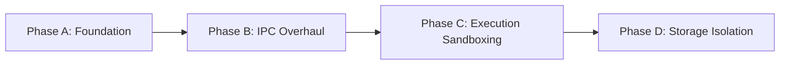

# Project Atlas — Perfection Loop Iteration 01

## Asynchronous Substrate and Core Parity

> *The transition from monolithic, interpreted architectures to high-performance, compiled, and mathematically verified systems represents the next evolutionary phase of autonomous agent frameworks.*

---

### Executive Summary

The current ecosystem is polarized between:

- **Feature-complete, resource-heavy orchestration layers** (exemplified by **OpenClaw**)
- **Highly optimized, resource-constrained binaries** (exemplified by emerging **ZeroClaw** architecture)

The **Savant framework**, guided by the **Atlas architectural strategy**, seeks to transcend this dichotomy.

#### Primary Objective

Establish a rigorous baseline for achieving **absolute feature parity** with OpenClaw's core capabilities while laying the asynchronous and architectural groundwork necessary to ultimately surpass ZeroClaw in:

- ⚡ Performance
- 🧠 Memory Efficiency  
- 🔒 Security Isolation

#### Perfection Loop Protocol

```
Feature Completeness > Pure Performance > Elegance
```

*Architectural optimizations must not preclude the implementation of core capabilities.*

---

## 🔍 Parity Audit: OpenClaw Capability Matrix

A precise and exhaustive understanding of OpenClaw's internal architecture is required to guarantee strict feature equivalence within the Savant architecture.

> **Key Insight**: OpenClaw is fundamentally *not* a conventional chatbot; it operates as a **local-first Gateway daemon** acting as the central control plane for sessions, channels, tools, and events. This Gateway routes normalized messages through the **pi-agent-core** subsystem, executing a continuous ReAct loop (perception → reasoning → action).

### Subsystem Audit Table

| OpenClaw Subsystem | Core Functionality & Mechanisms | File Reference | Savant Status (Atlas Scope) |
|-------------------|--------------------------------|----------------|---------------------------|
| **Agent Runtime** | `pi-agent-core` state machine: context assembly, model inference, tool execution, stream bridging, timeouts, unhandled promise rejection handling | `src/agent-loop.ts`, `pi-agent-core` | ❌ **Missing** — Requires deterministic state machine built on Rust async executor |
| **Tool Execution** | Localized capabilities (bash, file I/O, browser control); Node.js execution with optional Docker sandboxing | `src/agents/tools/`, `Dockerfile.sandbox` | ⚠️ **Gap** — Atlas proposes WASM sandboxing via Wassette; must map perfectly to OpenClaw's tool schemas |
| **Skill System** | On-demand prompt/capability injection; parses `SKILL.md` YAML frontmatter for descriptions & tool requirements | `src/agents/skills/frontmatter.ts`, `SKILL.md` | ❌ **Missing** — Savant lacks metadata parser & dynamic capability registry |
| **Memory Subsystem** | Persistent session transcripts + vector embeddings; SQLite + `sqlite-vec` for hybrid vector/keyword retrieval | `src/memory/internal.ts`, `MEMORY.md` | ⚠️ **Gap** — Atlas targets Fjall 3.0 + ruvector-core; data structures must align with OpenClaw |
| **Multi-Agent Routing** | Delegation & inter-agent communication; shifting from LLM-driven calls to deterministic `/subagents` spawn commands | `src/agents/subagent-spawn.ts`, `sessions-spawn-tool.ts` | ❌ **Missing** — Savant requires zero-copy IPC mechanism for parallel agent context passing |
| **Plugin Hooks** | Lifecycle interception points (`before_llm_call`, `before_tool_call`, `agent_end`) for middleware sanitization/modification | `plugins/hooks.js`, `attempt.ts` | ❌ **Missing** — Formal event-bus/hook system required in native Rust architecture |

### Audit Conclusion
>
> While the Atlas plan outlines superior infrastructure components, **Savant currently lacks the intricate connective tissue**—the orchestrating state machine—that makes OpenClaw functionally complete. The logic within OpenClaw depends heavily on TypeScript ecosystem nuances (dynamic object filtering, promise chaining) that must be rigorously translated into Rust's strict type system and borrowing rules.

---

## 🚧 Blocker Identification: The ReAct State Machine

### Highest-Priority Gap

**Absence of a fault-tolerant, fully asynchronous ReAct agent loop** equivalent to OpenClaw's `pi-agent-core` implementation (`agent-loop.ts`).

### Required Loop Sequence

```
intake → context assembly → model inference → tool execution → streaming replies → persistence
```

### Critical Asynchronous Control Flows

1. ⏸️ Pause language generation when tool call is emitted
2. 🔐 Execute tool securely within sandbox
3. 📥 Capture stdout/API response
4. ➕ Append resulting payload to context window
5. 🔁 Re-invoke model for continued reasoning

### Failure Management Requirements

The state machine must robustly handle:

- ❌ Unhandled API promise rejections
- 🧩 Malformed JSON payloads from LLM
- 📦 Unexpected data types during session transcript deserialization

> **Historical Example**: `agent-loop.ts` attempts to call `.filter()` directly on message content without verifying array type → process termination when models return non-standard formats during degraded states.

### Foundational Principle

```
Until Savant implements a bulletproof Rust equivalent of this state machine 
— managing memory access, tool dispatch, and multi-agent delegation without 
blocking the runtime or panicking on malformed data — 
advanced optimizations cannot be meaningfully integrated.

The ReAct loop is the foundational substrate; all other features are downstream dependencies.
```

---

## ⚙️ Atlas Validation: Asynchronous Substrate and Runtime

### Proposal Under Review

Utilize **spargio** as primary asynchronous runtime for Savant (challenging industry-standard **Tokio**).

### Architectural Distinctions

| Runtime | Model | Scheduling | Key Mechanism | Maturity |
|---------|-------|-----------|--------------|----------|
| **Tokio** | Readiness-based | Work-stealing, multi-threaded | epoll/kqueue polling + task queues | 🟢 Production-standard; powers mission-critical infrastructure |
| **spargio** | Completion-based | Submission-time steering across shards | Linux `io_uring` + `msg_ring` + CQE injection | 🟡 Experimental PoC; AI-generated; not fully reviewed |

### Performance Profile & Benchmarks

#### ✅ Where spargio Excels

| Benchmark | Scenario | spargio vs Tokio | Improvement |
|-----------|----------|-----------------|-------------|
| `steady_ping_pong_rtt` | Cross-shard coordination (2-worker request/ack loop) | 3.8x–4.1x faster | 🚀 High coordination overhead |
| `fs_read_rtt_4k` | 4 KiB file read @ queue depth 1 | 1.3x–1.6x faster | 💾 Heavy disk I/O |
| `high_depth_fs_net_admission_control_4k_read_256b_reply_window64` | Complex routing + deadline churn | 32.3ms vs 131.8ms | ⚡ 4.1x improvement |

> These metrics are highly attractive for multi-agent swarms relying on rapid disk reads for memory retrieval and high-frequency parallel message passing.

### ⚠️ Maturity Constraints & Parity Risks

```diff
! CRITICAL DISCLAIMER (from spargio documentation):
! "This code has not been manually reviewed in its entirety 
! and should be used for evaluation purposes only."
```

#### Known Limitations

- 🌐 Hostname-based `ToSocketAddrs` can block runtime during DNS resolution
- 📁 Certain filesystem helpers use compatibility blocking paths vs native async ops
- 🔐 Companion crates (`spargio-tls`, `spargio-ws`, `spargio-quic`) lack deep maturity for protocol-specific tuning
- 🔗 Full Tokio-compatibility shim is deprioritized by maintainer → massive investment required

### Validation Conclusion

```diff
- REJECTED for Phase 1: Wholesale replacement of Tokio with spargio
+ REASON: Violates "Parity Before Optimization" constraint
```

**Risk**: If network stack drops LLM connections or DNS blocks during critical generation, feature equivalence with OpenClaw is irreparably broken.

#### ✅ Optimized, Risk-Mitigated Strategy

```
Utilize Tokio for:
├─ Primary Gateway API
├─ Session routing
├─ WebSocket management  
└─ Overall state machine orchestration

Delegate to isolated spargio shards for:
├─ LSM-tree database writes (Fjall)
└─ High-frequency vector search (ruvector-core)

→ Leverage spargio::boundary for cross-runtime result exchange
```

---

## 📊 Gap Analysis: Savant vs ZeroClaw Architecture

### Target Definition

| Framework | Role for Savant |
|-----------|----------------|
| **OpenClaw** | ✅ Functional target (feature parity baseline) |
| **ZeroClaw** | 🎯 Performance/architectural target (efficiency ceiling) |

### Resource & Performance Discrepancies

| Metric | OpenClaw (Node.js) | ZeroClaw (Rust-native) | Impact |
|--------|-------------------|----------------------|--------|
| **Memory Footprint** | >1 GB typical | <5 MB envelope | 📉 200x reduction |
| **Cold Startup** | >500 ms | <10 ms | ⚡ 50x faster |
| **Binary Size** | N/A (interpreted) | 3.4–8.8 MB static | 📦 Edge-deployable |
| **Swarm Scaling** | 5 agents ≈ 5+ GB RAM | 5 agents ≈ negligible | 💰 Drastic OpEx reduction |

> ZeroClaw enables deployment on $10 edge hardware, Raspberry Pi, and minimal cloud instances — fundamentally changing autonomous swarm economics.

### Trait-Driven Polymorphism (ZeroClaw Strength)

```rust
// ZeroClaw's pluggable architecture (src/providers/traits.rs, etc.)
pub trait Provider { /* normalizes chat completions across OpenAI/Anthropic/Gemini/DeepSeek */ }
pub trait Memory { /* abstracts SQLite vector storage + caching */ }
pub trait Tool { /* defines executable capability interface */ }
```

**Savant Gap**: Lacks strict compile-time polymorphism. Must implement equivalent zero-cost abstraction trait system for independent component swapping.

**Savant Opportunity**: Surpass ZeroClaw by backing trait implementations with **Atlas stack zero-copy communication primitives**, eliminating memory duplication during swarm scaling.

---

## 💡 Innovation Proposal: Trait-Driven Parity via Zero-Copy Blackboard

### Core Strategy

Close functional parity gap with OpenClaw *while* exceeding ZeroClaw's performance via:

```
Trait-Driven ReAct State Machine
+
iceoryx2 Blackboard Pattern (zero-copy IPC)
+
WebAssembly Sandboxing (Wassette)
+
Dynamic Speculative Planning (DSP)
```

### 1️⃣ Zero-Copy Multi-Agent Coordination

#### Problem (Traditional Approach)

```
Orchestrator → [JSON serialize context] → Message Queue → [Deserialize] → Sub-agent
                              ↓
              Massive memory duplication + serialization overhead
              ↓
              Limits swarm density on constrained hardware
```

#### Savant Solution: iceoryx2 Blackboard

```rust
// iceoryx2: zero-copy, lock-free IPC middleware in Rust
// Blackboard pattern: shared-memory key-value repository

// Orchestrator writes task directives + session pointers to blackboard
blackboard_writer.publish(session_id, TaskDirective { ... })?;

// Sub-agent reads directly from shared memory pointer (no copy)
let task = blackboard_reader.subscribe(session_id)?;

// Result written back to same shared region
blackboard_writer.publish(session_id, ToolOutput { ... })?;
```

**Benefits**:

- ✅ Sub-microsecond transmission latency
- ✅ Zero memory duplication for context passing
- ✅ Enables high-density swarm deployments on edge hardware

### 2️⃣ WebAssembly Tool Sandboxing via Wassette

#### OpenClaw Approach

- Docker containers (`Dockerfile.sandbox`)
- ✅ Strong isolation
- ❌ Resource-heavy, slow cold-start, high memory overhead

#### Savant Approach: Microsoft Wassette

```
Wassette = WebAssembly Component Model + Model Context Protocol (MCP) bridge
         + Wasmtime engine (security-first, mathematically correct)
```

**Advantages**:

| Feature | Benefit |
|---------|---------|
| 🔐 Fine-grained, deny-by-default capabilities | Parity with Docker isolation, fraction of overhead |
| 🧩 Dynamic skill injection | Parse `SKILL.md` equivalents → Wasm Components |
| 🌐 OCI registry integration | Agents fetch/execute/discard tools autonomously |
| ⚡ Sub-millisecond cold start | Surpasses ZeroClaw resource efficiency |

### 3️⃣ Advanced Storage: Fjall 3.0 + ruvector-core

#### OpenClaw Baseline

- SQLite + `sqlite-vec` extension
- ✅ Functional for single-agent
- ❌ Write amplification + lock contention under multi-agent load

#### Savant Stack

```
Memory Trait Implementation:
├─ Fjall 3.0 (LSM-tree key-value store)
│  ├─ Sequential immutable SSTable flushes
│  ├─ Higher random write throughput vs B-trees
│  └─ Built-in LZ4 compression
│
└─ ruvector-core (SIMD-accelerated vector engine)
   ├─ AVX2/AVX-512 + NEON hardware acceleration
   ├─ Scalar/Binary quantization (up to 32x memory compression)
   └─ 61µs p50 search latency @ 384-dim vectors (HNSW)
```

### 4️⃣ Cognitive Acceleration: Dynamic Speculative Planning (DSP)

#### Problem

ReAct loop inference latency + API costs scale linearly with reasoning depth.

#### DSP Solution

```
Adaptive framework using online RL to dynamically adjust speculative steps (k)

State Space: Token sequences representing partial trajectories
Action Space: Integer number of speculative steps  
Reward Function: Match rate between speculative & target agent validation

Loss Function: Expectile Regression with asymmetric penalties
→ Bias toward aggressive latency reduction OR conservative cost management
```

**Empirical Results**:

- ✅ Comparable efficiency to fastest lossless acceleration methods
- 💰 Up to 30% reduction in total operational costs
- ♻️ Up to 60% elimination of redundant computational waste

### 5️⃣ Automated Coding System Integration

Per `ECHO_v1_5_ATLAS_SWARM_EDITION.md` directive:

```
ECHO System = Persistent sub-agent using Wassette sandbox
            → Executes compiler checks + test suites autonomously

ReAct Loop Integration:
1. Agent generates code candidate
2. ECHO validates (stdout/stderr diffs)
3. Validation output written to iceoryx2 blackboard
4. LLM receives diff as environmental observation
5. Loop continues with self-correcting refinement

→ Closed-loop, autonomous code generation mechanism
```

---

## 🗺️ Implementation Blueprint

### Dependency Map & Stack

| Layer | Technology | Purpose |
|-------|-----------|---------|
| **Orchestration & Network** | `tokio v1.x` | Primary executor for Gateway HTTP/WebSocket endpoints + Channel Routing |
| **State Machine** | Custom Rust `AgentLoop` | ReAct loop implementation adhering to trait definitions |
| **IPC / State Sharing** | `iceoryx2 v0.8.0+` | Blackboard messaging pattern for zero-copy memory access |
| **Tool Execution** | `wassette` | Wasmtime sandboxing + MCP translation |
| **Storage (Memory)** | `fjall v3.0` + `ruvector-core` | LSM-tree storage + SIMD-accelerated HNSW vector indexing |
| **Verification** | `kani-verifier` | Bit-precise model checking for unsafe FFI boundaries |

### Rust Architecture Sketch

```rust
use std::sync::Arc;
use serde_json::Value;
use iceoryx2::prelude::*;
use async_trait::async_trait;

// ─────────────────────────────────────────────────────────────
// 1. Zero-Cost Abstraction Traits (Parity with ZeroClaw)
// ─────────────────────────────────────────────────────────────

#[async_trait]
pub trait Tool: Send + Sync {
    fn name(&self) -> &str;
    fn capabilities(&self) -> CapabilityManifest;
    /// Utilizes Wassette to execute WASM component within strict sandbox
    async fn execute(&self, args: Value) -> Result<ToolOutput, AgentError>;
}

#[async_trait]
pub trait MemoryBackend: Send + Sync {
    /// Interacts with Fjall LSM-tree + ruvector-core inside spargio boundary
    async fn retrieve_context(&self, query: &[f32], top_k: usize) 
        -> Result<Vec<MemoryNode>, AgentError>;
    async fn consolidate(&self) -> Result<(), AgentError>;
}

// ─────────────────────────────────────────────────────────────
// 2. The ReAct State Machine (Parity with OpenClaw's pi-agent-core)
// ─────────────────────────────────────────────────────────────

pub struct AgentLoop<M: MemoryBackend> {
    provider: Box<dyn Provider>,
    memory: M,
    tools: Arc<ToolRegistry>,
    blackboard_writer: BlackboardWriter<SessionState>,
}

impl<M: MemoryBackend> AgentLoop<M> {
    pub async fn run(&mut self, session_id: SessionId, input: Message) 
        -> Result<(), AgentError> 
    {
        loop {
            // 1. Context Assembly (Vector retrieval → ruvector-core)
            let context = self.memory
                .retrieve_context(&input.embedding, 5)
                .await?;
            
            // 2. Model Inference (Tokio handles non-blocking LLM network request)
            //    Integrates Dynamic Speculative Planning (DSP) for latency reduction
            let response = self.provider
                .generate_completion_with_dsp(context)
                .await?;
            
            match response.action {
                Action::Reply(text) => {
                    // Update shared state via zero-copy IPC
                    self.blackboard_writer.update(session_id, text)?;
                    break;
                },
                Action::ToolCall(tool_req) => {
                    // 3. Tool Execution (Sandboxed via Wassette/Wasmtime)
                    let tool = self.tools.get(&tool_req.name)?;
                    let result = tool.execute(tool_req.args).await?;
                    self.append_to_transcript(result);
                },
                Action::Delegate(sub_agent_task) => {
                    // 4. Sub-agent Spawning (Zero-copy IPC via iceoryx2 Blackboard)
                    self.spawn_subagent_via_blackboard(sub_agent_task).await?;
                    // Yield control to Tokio executor while awaiting completion
                }
            }
        }
        Ok(())
    }
}
```

### Migration Path (Phased Rollout)



| Phase | Objective | Key Actions | Success Criterion |
|-------|-----------|------------|------------------|
| **A: Foundation** | Guarantee fundamental parity with OpenClaw routing/tool logic | • Implement `AgentLoop` with pure Tokio<br>• Use `Arc<Mutex<HashMap>>` for in-memory state | ✅ Baseline logic functions without IPC complexity |
| **B: IPC Overhaul** | Enable zero-copy multi-agent delegation | • Swap in-memory state for iceoryx2 Blackboard<br>• Implement blackboard read/write primitives | ✅ `/subagents` spawn capability with <1µs IPC latency |
| **C: Execution Sandboxing** | Achieve superior tool isolation vs Docker | • Integrate Wassette runtime<br>• Parse `SKILL.md` → Wasm Component capabilities | ✅ Dynamic skill injection with deny-by-default capabilities |
| **D: Storage Isolation** | Maximize throughput, prevent event loop starvation | • Wrap Fjall + ruvector-core in `spargio::boundary`<br>• Delegate heavy I/O off Tokio executor | ✅ High-frequency memory ingestion without blocking core loop |

---

## 🎯 Validation Plan

### Success Metrics

| Category | Metric | Target | Baseline Reference |
|----------|--------|--------|-------------------|
| **Feature Parity** | Parse OpenClaw-compatible `SKILL.md` → Wassette config → execute tool → yield response | ✅ Zero crashes, full loop completion | OpenClaw ReAct test suite |
| **Memory Efficiency** | Idle Resident Set Size (RSS) of compiled binary | **<15 MB** | ZeroClaw: <5 MB; OpenClaw: >1 GB |
| **IPC Throughput** | Sub-agent spawning data transfer latency | **<1 µs** | Tokio channel JSON serialization: ~100–500 µs |
| **Startup Time** | Cold binary launch to ready state | **<50 ms** | ZeroClaw: <10 ms; OpenClaw: >500 ms |

### Benchmark Commands (Theoretical)

```bash
# Measure pure coordination latency under highly imbalanced load
cargo bench --bench agent_delegation_throughput --features "iceoryx2_backend"

# Measure peak memory + CPU during heavy tool execution loops
/usr/bin/time -v target/release/savant_daemon --run-workload web_search_skill_eval

# Validate ReAct loop stability under malformed input stress
cargo test --test react_loop_fuzz -- --nocapture
```

### Baseline Definition

```
Success = Executing OpenClaw ReAct loop test suite 
          WHILE maintaining memory footprint approaching ZeroClaw's extreme threshold
```

---

## ⚠️ Risk Assessment & Mitigation Strategies

### 1. Wassette Immaturity

| Risk | Impact | Mitigation |
|------|--------|-----------|
| Early-development runtime may lack complex host-binding features for legacy OpenClaw skills | Tool execution failures, capability gaps | ✅ Implement native Rust fallback executor wrapped in OS-level sandbox (`chroot`/`bwrap`) for Wasm compilation failures |

### 2. Storage Amplification with Fjall

| Risk | Impact | Mitigation |
|------|--------|-----------|
| Improper memtable flush thresholds → severe write amplification → flash storage degradation on edge devices | Reduced device lifespan, performance collapse under load | ✅ Rigorous edge-deployment config profiles + custom compaction filters to rate-limit disk I/O during massive ingestion phases |

### 3. spargio Instability

| Risk | Impact | Mitigation |
|------|--------|-----------|
| Unreviewed PoC → kernel panics, io_uring deadlocks, cross-shard messaging failures | System instability, data corruption | ✅ Strict isolation behind standard Rust async traits<br>✅ Trivial fallback to `tokio::task::spawn_blocking` for Fjall interactions<br>✅ No broader codebase logic changes required on rollback |

### 4. Kani Verification State Explosion

| Risk | Impact | Mitigation |
|------|--------|-----------|
| Full ReAct loop BMC → combinatorial explosion → infeasible SAT/SMT solving → CI pipeline delays | Slowed development, verification gaps | ✅ Restrict Bounded Model Checking to:<br>  • Unsafe blocks handling iceoryx2 shared memory pointers<br>  • Specific FFI boundaries bridging Wassette execution layer<br>✅ Validate broader HTTP gateway logic via standard integration testing |

---

## 📋 Phase 1 Deliverables Checklist

```diff
+ [ ] AgentLoop state machine (Tokio-based, trait-driven)
+ [ ] iceoryx2 Blackboard integration for zero-copy IPC
+ [ ] Wassette runtime integration for WASM tool sandboxing  
+ [ ] Fjall 3.0 + ruvector-core storage backend (spargio-boundary isolated)
+ [ ] SKILL.md → Wasm Component capability parser
+ [ ] Dynamic Speculative Planning (DSP) integration point
+ [ ] ECHO validation loop integration via blackboard
+ [ ] Kani verification for critical unsafe boundaries
+ [ ] Benchmark suite for parity + performance validation
+ [ ] Fallback executors + rollback pathways documented
```

---

> **Perfection Loop Mantra**:  
> *"Optimize only what is proven necessary. Parity first. Performance second. Elegance third."*  
> — Atlas Architectural Directive v1.0

*Document Version: 0.1 • Last Updated: 2026-03-13 • Classification: Internal Draft*
